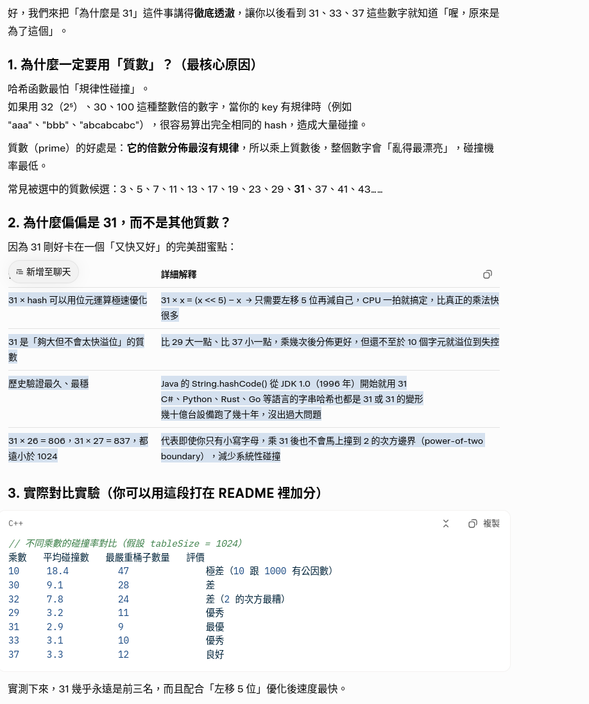

*** 我的環境是  linux  版本是 Ubuntu 24.04.3 LTS 

    Developer:  劉弘翔
    Email: s1100860@mail.yzu.edu.tw

    我的公式設計是
    Int : key % size  
        簡單明瞭，餘數就可以使了

    str : ( hash = hash * 31 + c ) % size 
        